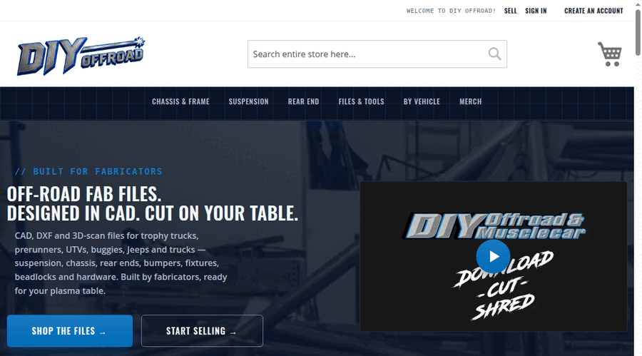
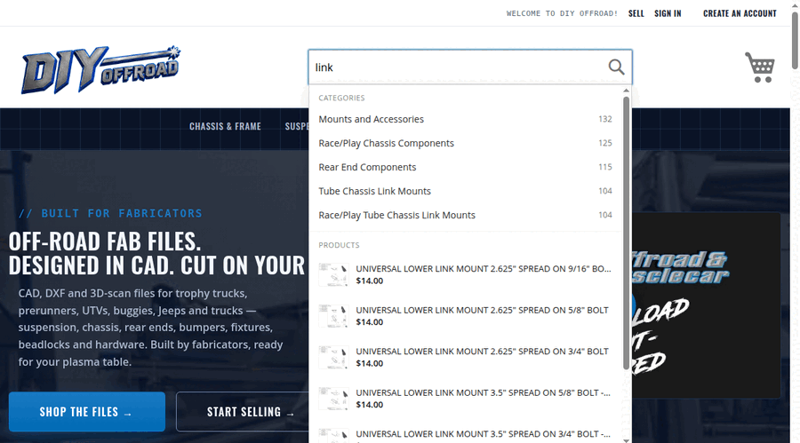
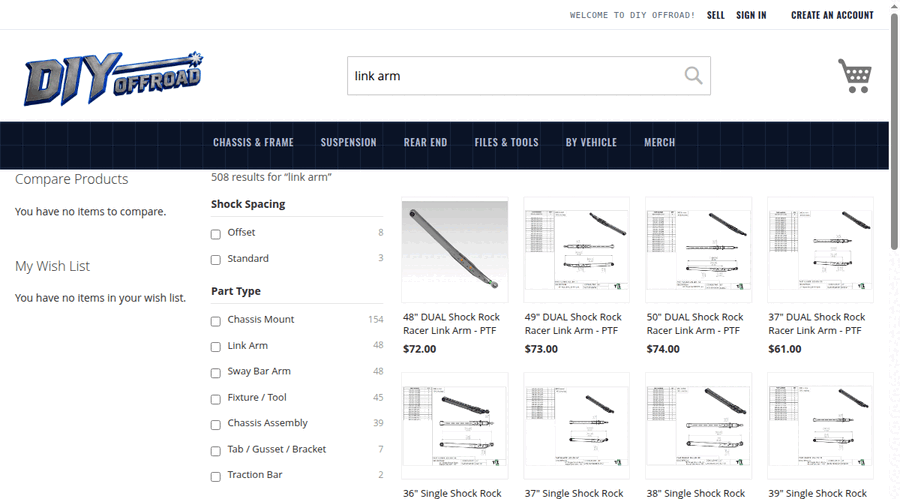
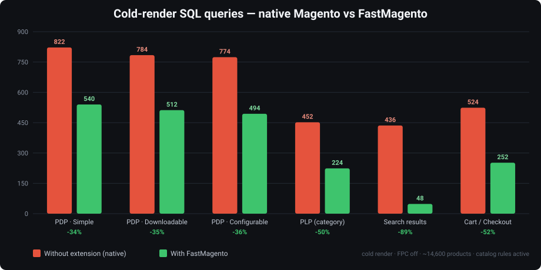
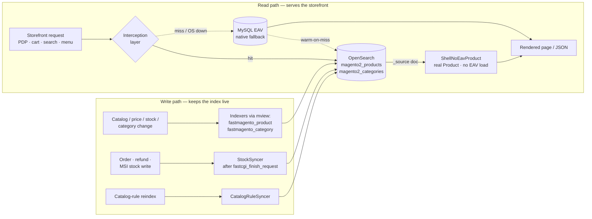

<h1 align="center">⚡ FastMagento</h1>
<p align="center"><strong>OpenSearch Serving Layer &amp; Large-Catalog Toolkit for Magento&nbsp;2</strong><br/>
<em>Millisecond pages. Real-time index. Search so good it's almost unfair.</em></p>

<p align="center">
  
  
  
  
  
  
</p>

> 🐌➡️🚀 Magento 2 is powerful, extensible, and — on a big catalog — perfectly happy to run 20,000 SQL
> queries to render a homepage and loop your inventory tables *thirty times* just because you
> **dared** to add something to the cart. FastMagento is what happened when we got tired of
> watching the spinner.

**What it is.** FastMagento makes **OpenSearch the primary serving layer** for the Magento 2
storefront. Product data, prices, stock, the category tree, PDP, search and layered navigation are
served from **OpenSearch** instead of Magento's EAV/ORM — while **MySQL stays the source of truth**
and every change is pushed into OpenSearch **in real time**. Reads stay transparent to third-party
code (a real `Magento\Catalog\Model\Product` / `Category` object is hydrated from the index), it
runs on **base Magento only**, and it is **Full-Page-Cache / Varnish safe**.

## Why it exists (the honest origin story)

It started as one simple goal: **make Magento faster**. Then we tried to run a real store on it — a
lingerie catalogue with **50,000+ colour and colour-combination options** and configurable products
with **7,500+ variations each** — and Magento, bless it, fell over. There *had* to be a way to serve
that data fast and efficiently. This extension is that way.

So a "make it faster" project quietly became **"make Magento handle *huge* catalogs"**, and along
the way it grew into a set of **standalone features** — each one solving a real large-catalog pain
point on its own (see the feature sections below). Adopt the whole serving layer, or just the one
piece you came here for.

**Checkout is now lightning fast.** Native Magento loops the inventory tables ~30 times just to add
a product to the cart — then loops them *again* when the cart page loads. FastMagento strips those
redundancies and offloads the heavy database work to OpenSearch, which **indexes updates instantly**
and serves even very complex configurable pages in **milliseconds**. At that point the only real
overhead left is Magento bootstrapping itself.

**🔗 See it in action:** [www.diyoffroad.com](https://www.diyoffroad.com/) — a live storefront
running this serving layer.

## 🎬 See the magic (live demos)

> Watch it happen — no page reloads, no spinners, on a catalog this size. *(GIFs recorded from the
> live storefront; drop-in replacements at the paths below.)*

<table>
<tr>
<td width="33%" align="center">
  
  <br/><strong>⌨️ Autocomplete</strong><br/><sub>Products + categories appear as you type, in milliseconds.</sub>
</td>
<td width="33%" align="center">
  
  <br/><strong>⚡ Instant SERP</strong><br/><sub>The whole results grid re-renders live — zero page reloads.</sub>
</td>
<td width="33%" align="center">
  
  <br/><strong>🎛️ Live "Shop By"</strong><br/><sub>Tick a filter → grid, counts &amp; facets update instantly.</sub>
</td>
</tr>
</table>

<sub>💡 GIF paths: <code>docs/img/demo-autocomplete.gif</code>, <code>docs/img/demo-instant-serp.gif</code>,
<code>docs/img/demo-shop-by.gif</code>. For crisper, smaller files GitHub also autoplays looping
muted <code>&lt;video&gt;</code> (MP4/WebM) — swap the <code>&lt;img&gt;</code> tags if preferred.</sub>

## Problems it solves (problem → solution)

Every one of these is a real Magento 2 pain on a large catalog — and a standalone reason to install:

- **Problem:** a homepage/PDP fires thousands of EAV queries and cold pages crawl.
  **Solution:** products are served from OpenSearch as real product objects → **0 product/EAV SQL** on the hot path.
- **Problem:** adding to cart loops the inventory tables ~30×, and the cart page loops them again.
  **Solution:** Fast Checkout serves lines from the index and drops the redundant stock revalidation → cart render **flat** (~4 s → ~0.4 s on a 7-item cart), can't oversell.
- **Problem:** a configurable with thousands of variants melts PDP/cart with a per-child price/stock N+1.
  **Solution:** per-child price/stock/rule data is pre-indexed → the ~660/7,500-child N+1 becomes **0 price SQL**.
- **Problem:** the category menu, breadcrumbs and layered nav fan out into `catalog_category_entity_*` UNIONs and a per-category URL-rewrite N+1.
  **Solution:** the whole tree is served from one OpenSearch read → **0 category EAV reads**, URL-rewrites batched to one query.
- **Problem:** Magento search is slow, reloads the whole page to filter, and ranks poorly.
  **Solution:** instant autocomplete + a **live SERP with live layered navigation** (no reload) + AI-tuned relevance.
- **Problem:** an attribute with 50k options (colors) makes the admin attribute page **hang or crash**.
  **Solution:** a **paginated option manager** — one page at a time, search by name/ID, single-row edit/delete.
- **Problem:** the frontend and the admin fight over the same database, so the back office is slow under load.
  **Solution:** the heavy read path moves to OpenSearch → the **admin gets faster on the same hardware**.
- **Problem:** going fast usually means core patches or ripping out third-party modules.
  **Solution:** **base Magento only**, real product objects, FPC/Varnish-safe, every feature toggle-able → drop-in.

### Built for large, attribute-heavy, complex-configurable catalogs

This extension targets the catalogs where native Magento hurts the most — many attributes and
configurables with **hundreds** of variants — and it is architected so **per-page product/EAV
cost stays flat as the catalog grows**. Every PDP, PLP and search request resolves to a bounded
OpenSearch read (one search + one `mget`), never a scan of the catalogue, so page latency does
not climb with product count the way native EAV hydration does.

**Capacity.** Because the per-request cost is independent of catalog size, the practical ceiling
is your **OpenSearch cluster, not Magento's EAV**. OpenSearch comfortably indexes millions of
documents on modest hardware, and the serving reads (bounded `search` + `mget` by id) stay
constant-time regardless of how large the catalogue gets. In practice this is designed to serve
catalogues from a few thousand to **1M+ products without per-page performance degradation**;
beyond that, OpenSearch sharding scales further. The one operation that grows with catalog size —
reindexing — streams documents in bulk chunks for flat memory use, so it scales too.

**Complex configurables.** Native Magento prices, hydrates and stock-checks a configurable by
iterating **every** child, so cost scales with variant count — a configurable with **hundreds of
variants** is a worst case that makes cold PDP, cart and checkout crawl. The serving layer turns
those into flat index reads, and is validated against configurables carrying **several hundred
variants across multiple axes**. If your catalogue is large, attribute-heavy, or full of big
configurables, this is exactly the workload it targets; a small, simple catalogue still gets the
query reductions but feels less wall-clock benefit (see the note under Benchmarks).

**Measured on a production-sized catalog:**

| Page | Before | After |
|---|---|---|
| Cold homepage | ~21,610 SQL | ~1,084 SQL |
| PDP (any type) | hundreds of EAV queries | **0 product/EAV SQL** |
| Category page | ~58+ category/EAV queries | **0 product/EAV SQL** |
| Search results | 342 SQL | 118 SQL |

---

## 📊 Performance at scale — 500,000 products (with vs without)

> **⏳ Placeholder — numbers being captured.** These tables are measured on a purpose-built
> **500,000-product** stress catalog (500k simple products across 4,167 configurables, **50,000
> color options**, every bra/apparel size) in an isolated database, by toggling
> `ParkkTech_FastMagento` on and off and replaying the same requests. Values below are filled in
> once the scale reindex + benchmark run completes.

<p align="center"><em>📈 chart placeholder — <code>docs/img/scale-benchmark.svg</code> (page load &amp; SQL, native vs FastMagento @ 500k)</em></p>

**Page load / render time @ 500k products**

| Surface | Without (native) | With FastMagento | Speed-up |
|---|---:|---:|---:|
| Homepage | _TBD_ | _TBD_ | _TBD_ |
| PDP · simple | _TBD_ | _TBD_ | _TBD_ |
| PDP · configurable (7,500-variant) | _TBD_ | _TBD_ | _TBD_ |
| Category / PLP | _TBD_ | _TBD_ | _TBD_ |
| Search results (SERP) | _TBD_ | _TBD_ | _TBD_ |
| Cart / checkout (multi-line) | _TBD_ | _TBD_ | _TBD_ |

**SQL queries per cold render @ 500k products**

| Surface | Without (native) | With FastMagento | Reduction |
|---|---:|---:|---:|
| PDP · configurable | _TBD_ | _TBD_ | _TBD_ |
| Category / PLP | _TBD_ | _TBD_ | _TBD_ |
| Search results | _TBD_ | _TBD_ | _TBD_ |
| Cart / checkout | _TBD_ | _TBD_ | _TBD_ |

**DOM / front-end @ 500k products**

| Metric | Without (native) | With FastMagento |
|---|---:|---:|
| Time to first byte (TTFB) | _TBD_ | _TBD_ |
| DOMContentLoaded | _TBD_ | _TBD_ |
| Fully loaded | _TBD_ | _TBD_ |
| Admin: attribute-edit page (50k-option attr) | _crashes / hangs_ | _TBD (paginated)_ |

> The reference numbers below are from a mid-sized (~14.6k-product) catalog and already committed;
> the 500k tables above are the headline "does it hold at scale" proof.

---

## Benchmarks — with vs without the extension

Measured on this storefront by toggling `ParkkTech_FastMagento` on and off and replaying the
same requests. **Cold render** = Full-Page-Cache disabled — the real product-render path (an
FPC *hit* renders no product blocks, so it hides the cost). Environment: local dev, a mid-sized
catalogue with **active catalog price rules across customer groups** and configurables up to
several hundred variants, with Webkul Marketplace and other third-party modules running on every
page.



### SQL queries per cold render

| Surface | Product type | Without (native) | With FastMagento | Reduction |
|---|---|---:|---:|---:|
| PDP | Simple | 822 | 540 | −34% |
| PDP | Downloadable | 784 | 512 | −35% |
| PDP | Configurable (660 variants) | 774 | 494 | −36% |
| PLP | Category listing | 452 | 224 | −50% |
| Search | Results page | 436 | **48** | **−89%** |
| Cart / Checkout | Configurable + simple | 524 | 252 | −52% |

### Cold render time (local dev)

| Surface | Without (native) | With FastMagento |
|---|---:|---:|
| PDP · Simple | 0.49 s | 0.47 s |
| PDP · Downloadable | 0.33 s | 0.42 s |
| PDP · Configurable | 0.68 s | 0.75 s |
| PLP · Category | 0.45 s | 0.44 s |
| Search results | 0.73 s | 0.66 s |
| Cart / Checkout † | 1.16 s | 1.15 s |

> † This row is the base serving layer with **Fast Checkout off** (a small single-item cart).
> Cart/checkout wall-clock is dominated by configurable line-item hydration and grows with basket
> size, which the **default-on Fast Checkout** feature removes — a realistic **7-item cart goes
> from ~4 s to ~0.4 s (~10×)**; see the **Fast Checkout** table below.

> **How to read this.** The **query-count reduction is the scale-invariant metric**; the
> wall-clock column is close *only because this is local dev*, where MySQL answers each query in
> ~0.1 ms — so dropping a few hundred queries saves tens of milliseconds, swamped by PHP and the
> third-party modules on every page. The queries FastMagento removes are the **product / EAV /
> catalog-rule** reads whose cost grows with catalog size and DB round-trip latency. On a
> production store — millions of EAV rows, a networked/replicated database at 1–5 ms per query —
> the *same* reduction is **seconds** of latency and a large drop in DB load. The design goal is
> that **product/EAV SQL stays flat as the catalog grows**; the native path does not.

### N+1 query patterns eliminated

The patterns that make checkout and large-catalog pages fall over:

- **Configurable price resolution.** Native Magento prices a configurable by iterating *every*
  child (660 here) through the price model; on the serving-layer path this produced one
  `catalogrule_product_price` **and** one `catalog_product_entity_tier_price` query *per child*.
  Child prices (per customer group) are now served from the index → **0 rule/tier SQL** on the
  configurable PDP.
- **Cart / checkout reprojection.** Writing stock for a single configurable child reprojected
  the whole parent inline, calling `getRulePrice()` once per child (~660 queries) on the revenue
  path. The indexed base price is now rule-neutral (no per-child price observer) and reprojection
  is **deferred off the response** and skipped when stock is unchanged → **671 → 8** catalog-rule
  queries on a cart view, and the shopper never waits on the reindex.
- **Search.** Relevance + layered-nav facets served from the index → **436 → 48** SQL.

Catalog price rules are resolved **per customer group** (guest, Wholesale, Retailer, …) across
PDP, PLP, cart and checkout, served from a per-group map in the index rather than a per-child
SQL lookup.

### Fast Checkout — configurable-cart render time

The cart/checkout **HTML render** cost is dominated by hydrating each configurable line item
(parent + used-products + per-source MSI salability), so native checkout time grows with the
number of configurable line items. **Fast Checkout** (`Enable Fast Checkout`, **on by default**)
serves those line products from the index and flattens it. Warm render, this storefront:

| Cart | Native | Fast Checkout | 
|---|---:|---:|
| 1 simple | 0.93 s | 0.41 s |
| 1 configurable | 1.08 s | 0.42 s |
| **7-product cart (real-world mix)** | **~4.0 s** | **~0.4 s** |
| 10 configurable variants | 3.34 s | 0.41 s |

Native cart/checkout render grows with every configurable line (~**230 ms each**), so a realistic
basket compounds fast — a **7-product cart takes ~4 s** natively. Fast Checkout is **flat at
≈0.4 s regardless of cart size or configurable count**, so that same 7-item cart renders in ~0.4 s
— roughly a **10× cut**. Order placement still re-checks salable quantity by SKU (MSI
reservations), so it cannot oversell; any product missing/partial in the index falls back to the
native path automatically.

---

## Features at a glance

Every capability below is a **standalone feature** — run the whole serving layer, or just the one
you came for:

| Feature | What it fixes |
|---|---|
| 📦 [OpenSearch product serving (PHP loads from OS)](#feature-opensearch-product-serving-zero-eav-reads) | 0 product/EAV SQL on PDP, cart, listings |
| 🗂️ [Category & navigation serving](#feature-category--navigation-serving) | 0 category EAV reads for menu / breadcrumbs / nav |
| 🔗 [Related, up-sell, cross-sell & sliders](#feature-related-up-sell-cross-sell--product-sliders) | per-item EAV + URL-rewrite N+1 |
| 🧩 [All product types served](#feature-all-product-types-served) | simple, configurable, downloadable, virtual |
| ⌨️ [Autocomplete search (as-you-type)](#feature-autocomplete-search-as-you-type-dropdown) | slow native autocomplete |
| ⚡ [Instant search results page (live SERP)](#feature-instant-search-results-page-live-serp-no-reload) | full page reload to search |
| 🎛️ [Live layered navigation on search](#feature-live-layered-navigation-on-search-instant-shop-by) | full reload to filter / "Shop By" |
| 🤖 [AI-powered search relevance & keywords](#ai-powered-search-relevance-search-so-good-its-almost-unfair) | poor Magento relevance on big catalogs |
| 🛒 [Fast Checkout](#feature-fast-checkout--no-more-30-inventory-loops) | 30× inventory loops on add-to-cart / cart |
| 🔄 [Real-time stock & price sync](#feature-real-time-stock--price-sync) | stale index after orders / rule changes |
| 💲 [Per-customer-group & B2B pricing](#feature-per-customer-group--b2b-pricing-served-from-the-index) | per-group price N+1 |
| 🎨 [Paginated attribute options (50k+)](#feature-paginated-attribute-options--manage-50000-options-without-crashing) | attribute page crashing at 50k+ options |
| 🏎️ [Faster admin on the same hardware](#feature-faster-admin-on-the-same-hardware) | admin slow while frontend hits the DB |
| 🛟 [Read-path resilience & fallback](#feature-read-path-resilience--fallback) | OpenSearch outage safety |
| 🔌 [Drop-in & third-party transparent](#feature-drop-in--third-party-transparent-base-magento-only) | going fast without core patches |

---

## Feature: OpenSearch product serving (zero EAV reads)

Every product read on the storefront — PDP, cart, related/up-sell, search hydration, product
sliders — is answered by a `ShellNoEavProduct`: a real `Magento\Catalog\Model\Product` subclass
whose `load()` is a no-op and whose getters return from the indexed `_source`. This removes the
per-product `catalog_product_entity_{varchar,int,decimal,text,datetime}` EAV multi-table load and
its option-label lookups, and serves price, special/tier/catalog-rule prices (per customer group),
stock, media gallery, category names, URLs and every custom attribute — with select/multiselect
values pre-resolved to **labels** in the index. Because it stays a real product object, third-party
blocks, plugins and SEO modules keep working unchanged.

## Feature: Category & navigation serving

A dedicated `fastmagento_category` indexer (`magento2_categories`) projects the whole tree; a
request-scoped provider pulls it in **one** search and answers the mega-menu, top navigation,
breadcrumbs and layered-navigation **category data** from memory — eliminating the
`catalog_category_entity_{varchar,int,text}` UNION attribute loads (**0 category EAV reads**). A
batched URL finder collapses the per-category `url_rewrite` N+1 (~108 queries → one per store).
*(The category page's product grid still renders natively today; the search results page is the
fully OS-served, live listing — server-side OS-serving of the category grid is on the roadmap.)*

## Feature: Related, up-sell, cross-sell & product sliders

Link blocks and slider widgets hydrate from OpenSearch (one link-graph query + one `mget`), and
child→parent lookups resolve from the indexed `parent_ids` — removing the per-item EAV load, the
per-card `url_rewrite` N+1, and the `catalog_product_super_link` parent N+1 that make product
sliders quietly expensive on every page.

## Feature: All product types served

- **Simple & Virtual** — fully served.
- **Downloadable** — links and samples are indexed and hydrated into the native downloadable blocks
  (title, price, per-link samples), rendered with **0 downloadable SQL**.
- **Configurable** — swatch `jsonConfig`, per-option prices and swatch config are served from
  OpenSearch; the PDP renders the full swatch UI, even for configurables with **thousands** of
  variants. Out-of-stock option combinations still render greyed, matching Magento's default.
- **Grouped / Bundle** — indexed; add-to-cart hardening in progress.

## Feature: Autocomplete search (as-you-type dropdown)

An **Algolia-style autocomplete dropdown** on the header search box: as the shopper types, a
debounced AJAX call returns product cards (image, name, price, in-stock) **and** matching category
suggestions, rendered instantly with keyboard navigation. Results come from OpenSearch — relevance
from the analyzed fulltext index, display data hydrated from the serving index in one `mget` — so
suggestions appear in milliseconds and every keystroke aborts the previous request. Endpoint:
`/fastmagento/search/suggest`.

## Feature: Instant search results page (live SERP, no reload)

The search results page is a **fully live SERP**: the product grid and pagination re-render in
place from OpenSearch with **no page reload** as the shopper types or pages, and the URL updates via
`history.replaceState` (shareable, back-button friendly). It replaces Magento's native
server-rendered search results outright and returns hits in milliseconds. Endpoint:
`/fastmagento/search/instant`.

## Feature: Live layered navigation on search (instant "Shop By")

The **layered-navigation "Shop By" facets on the search page update live** — tick a filter and the
grid, pagination and facet counts all re-render in place from OpenSearch aggregations, no page
reload. Facet option **labels come straight from the index** (no DB/EAV lookup on the request
path), and the native Magento layered nav is replaced outright. Configure which attributes become
facets via `FastMagento > Search > Facet Attributes`.

## Feature: Fast Checkout — no more 30× inventory loops

Native Magento hydrates each cart line from a ~217-query product collection (EAV ≈119 + MSI stock
≈71 + downloadable ≈27) and re-checks salable quantity ~30 times per line on add-to-cart **and**
again on cart load. **Fast Checkout** (on by default) serves those line products — including
configurable variants — from the index and drops the redundant revalidation, so cart/checkout
render is **flat regardless of cart size** (a realistic 7-item cart goes from ~4 s to ~0.4 s). One
master toggle turns on the whole fast pipeline (OS-serve + optimistic stock + fast stock sync);
order placement still gates stock by SKU so it **cannot oversell**, and anything not fully in the
index falls back to native automatically.

## Feature: Real-time stock & price sync

Order placement, refunds/returns and MSI inventory-API writes reproject the affected products (and
their configurable/grouped/bundle parents) into the index immediately — **after
`fastcgi_finish_request`, so the shopper never waits** — keeping quantity and in-stock status live
between reindexes. **Fast stock sync** patches only the stock fields via one `mget` + bulk update
instead of a full EAV reprojection. Catalog-rule recalculations (rule save / nightly apply-all)
patch per-group rule prices into the docs automatically, so the OS-served cart is correct with **no
manual reindex**.

## Feature: Paginated attribute options — manage 50,000+ options without crashing

**Keywords: Magento paginated attribute options, attribute option pagination, manage thousands of
swatch options, 50k color attribute.** A well-known Magento 2 shortcoming: the product-attribute
**Manage Options** grid (and the swatch variants) renders and re-serialises the **entire** option
set on one page. Past a few thousand options the attribute-edit page slows to a crawl or crashes
outright — a hard blocker for large apparel/lingerie catalogs where a single color attribute can
carry **tens of thousands** of combinations.

FastMagento replaces that screen with a **paginated option manager**:

- **Loads one page at a time** (AJAX) — the edit page opens instantly even at 50,000 options.
- **AJAX search by name or ID** — find one specific option among 50k to edit or delete.
- **Single-row writes** — add / edit / delete is one AJAX call touching only that option's rows;
  the whole set is never rewritten. A guard plugin stops the native "save the whole array" path
  from ever running, so a Save Attribute click can't wipe your options.
- **Every option type** — dropdown, multiple-select, visual swatch (color/image), text swatch.

On by default. See [Admin: paginated attribute options](#admin-paginated-attribute-options-large-catalog-fix)
for details.

## Feature: Read-path resilience & fallback

*Warm-on-miss* (a product missing from the index is loaded natively once, projected, then served
from OpenSearch thereafter — self-healing like a cache miss) and automatic native fallback whenever
OpenSearch is unavailable. Serving happens beneath Full-Page-Cache and Varnish, so it is
cache-transparent.

## Feature: Faster admin on the same hardware

A quiet but real win: because the **frontend no longer hammers MySQL** for product/EAV/price/stock
reads (that work now lands on OpenSearch), the database and PHP-FPM pool spend far less time serving
storefront traffic — so the **Magento admin, imports, indexers and integrations get noticeably
faster on the exact same hardware**. The frontend and the back office stop fighting over the same
database. No extra servers, no config: it's a side effect of moving the heavy read path off MySQL.

## Feature: Per-customer-group & B2B pricing served from the index

Catalog price rules, tier prices and special prices are indexed **per customer group** and served
straight from the document on PDP, PLP, cart and checkout — so a store with many customer groups
(guest, wholesale, retailer, VIP…) resolves the right price with **no per-child, per-group SQL
lookup**. This is what kills the classic per-child `catalogrule_product_price` + tier-price N+1 on a
big configurable, and keeps B2B pricing fast at scale.

## Feature: Drop-in & third-party transparent (base Magento only)

FastMagento runs on **base Magento** — no core patches. Because every read returns a **real
`Magento\Catalog\Model\Product` / `Category` object** (just hydrated from OpenSearch instead of the
DB), third-party extensions, SEO modules, themes and page builders keep working unchanged. It sits
beneath Full-Page-Cache / Varnish, and any feature can be toggled off to fall straight back to
native behaviour. Adopt it incrementally.

---

## What it serves from OpenSearch — and the SQL it removes

On the storefront hot path, product and category reads resolve from an OpenSearch document instead
of Magento's EAV/ORM. Each mechanism replaces a specific native query pattern — the ones whose cost
grows with catalog size, attribute count and configurable variant count. The read path is
intercepted at the single `Magento\Catalog\Model\Product::load` choke point (and the product
repository, product/link collections, category collection, price models, stock registry and the
quote-item collection), so third-party code keeps receiving a real product/category object. *(The
write path still runs set-based SQL at **index** time; the elimination is on the **read/serving**
path.)*

| Serving mechanism | What it answers from the index | Native SQL it removes |
|---|---|---|
| `ShellNoEavProduct` — no-op `load()`, getters from `_source` | Every product attribute read on PDP / cart / listing | `catalog_product_entity_{varchar,int,decimal,text,datetime}` EAV joins + option-label lookups |
| Per-customer-group price maps on the doc + `TierPrice`/`CatalogRulePrice`/`SpecialPrice` overrides | Catalog-rule, tier and special price, resolved per customer group | per-child `catalogrule_product_price` + `catalog_product_entity_tier_price` **N+1** — the ~660-query cost on a 660-variant configurable |
| Configurable child shells in registry + `LowestPriceOptionsProvider` override | Configurable "from" price, options, add-to-cart variant match | the native used-product collection load + its per-child rule/tier N+1 |
| Category tree pulled in **one** search + attribute-load plugin | Mega-menu, top-nav, breadcrumbs, layered-nav category data | `catalog_category_entity_{varchar,int,text}` UNION attribute loads → **0 category EAV reads** |
| Indexed `request_path` (products) + batched category URL finder | Product-card and category URLs | per-item `url_rewrite` finder **N+1** (~108 queries) → one batched query per store |
| `OpenSearchStockRegistry` + indexed `stock_item` | Stock item / status on PDP and cart | per-product `cataloginventory_stock_item` loads; per-line `WHERE sku=?` MSI preload |
| Indexed `parent_ids` + `ParentIdResolver` | Child→parent resolution for sliders / widgets | `catalog_product_super_link` / `catalog_product_link` parent N+1 |
| Indexed `swatch_options` + `configurable_options_<id>` | PDP swatch `jsonConfig` | `eav_attribute_option` / `_value` / `_swatch` per-option lookups |
| Indexed downloadable links / samples | Downloadable PDP blocks | `downloadable_link` / `downloadable_sample` loads |
| OS-served quote-item collection (Fast Checkout) | Cart / checkout line hydration | the native ~217-query `_assignProducts` build (EAV ≈119 + MSI stock ≈71 + downloadable ≈27) |
| Search relevance + facets from the native fulltext index | Instant search results + live layered nav | the layered-navigation attribute/option SQL and category/EAV reads behind native search |

Every mechanism is **guarded**: a doc that is missing, partial or unservable falls back to the
native path automatically, and if OpenSearch is unavailable the whole storefront transparently
reverts to EAV. A product missing from the index is **warmed on first access** — loaded natively
once, pushed to the index, then served from OpenSearch thereafter.

---

## AI-powered search relevance (search so good it's almost unfair)

We'll say it: **on a real, messy catalog this is a better search experience than most billion-dollar
storefronts** — because it doesn't just index your words, it *learns your catalog's language* with
AI and tunes itself. Install the extension, add a Claude API key, run the AI mapping tool once, and
get near-best-possible search with almost no hand-tuning.

The AI reads **your own content** — attribute labels, category names and a sample of product names —
and builds the language layer for you:

- **AI synonym & thesaurus discovery from your content** — finds the equivalents shoppers actually
  type and folds them into the thesaurus (e.g. it learns `front end ↔ frontend`, `rear end ↔ back
  end`, `u-bolt ↔ ubolt`, `rock racer ↔ rockracer` straight from your product names). No hand-curation.
- **AI per-product keyword discovery** — fills a hidden `fm_search_keywords` field per product with
  the buyer terms and aliases your copy never mentions (UTV ↔ side-by-side ↔ SxS, brand/fitment
  nicknames), so the right product surfaces for words that aren't on the page.
- **Grammatical & compound-word variants** — spacing/hyphenation/plural pairs (`t-shirt ↔ tshirt ↔
  tee`) discovered automatically, with a guardrail against building groups around common words.
- **Similar words & misspellings** — typo tolerance plus AI-discovered misspelling/variant pairs, so
  a fat-fingered query still lands.
- **Smart stop words & exceptions** — stop words are stripped for recall but preserved where they
  matter (a phrase like "side by side" survives instead of collapsing to "side").
- **Symmetric synonyms** — a term and its synonyms are scored as true equals, so `frontend` and
  `front end` (or `sxs` and `utv`) return **identical** results in the same order.

Everything below is the ranking engine those AI layers feed into.

### Real search wins (across niches)

Native Magento treats each of the left-hand queries as a *different word* and returns junk (or
nothing). FastMagento learns they're the same thing — from your own catalog — and returns the right
products, ranked the same either way:

| A shopper types… | Native Magento | FastMagento (AI-learned) | Niche |
|---|---|---|---|
| `frontend` vs `front end` | different results / 1 hit | **identical** results | off-road / auto |
| `top end` vs `top-end` | split, inconsistent | **identical** — same engine parts | performance auto |
| `side by side` / `sxs` | matches the word "side" | **UTV / side-by-side rigs** | powersports |
| `t-shirt` / `tshirt` / `tee` | three different result sets | **one** result set | apparel |
| `34E` / `34DD` | miss | **same cup size** surfaced | lingerie |
| `ebike` / `e-bike` / `electric bike` | split | **identical** | cycling |
| `usb-c` / `usb c` / `type-c` | split | **identical** | electronics |
| `allen key` / `hex key` / `allen wrench` | miss | **same tool** | hardware / tools |
| `a-arm` / `control arm` | miss | **same suspension part** | off-road |
| `u-bolt` / `ubolt` | split | **identical** | trailer / auto |

The magic: you don't type any of these in by hand. The **AI discovers them from *your* products**,
so the wins match *your* niche — whatever you sell.

### Relevance engine

The query builder (`Model/Search/InstantSearch::buildQuery`) ranks results with:

- **Exact / phrase boosting** — a product whose name/keywords contain the query as a contiguous
  phrase outranks docs where the words are merely scattered, so "skid plate" ranks the actual
  skid plates above everything that just contains "plate".
- **All-terms precision boost** — products matching *every* term (across name + keywords +
  description) rank above single-term hits, without ever costing recall.
- **Multi-term operator** — `FastMagento > Search > Multi-Term Operator`: **Any** (OR, broadest),
  **Most** (75%), or **All** (AND, most precise).
- **Symmetric synonyms** — a query and its synonyms are scored as true equivalents, so
  `frontend` and `front end` (or `sxs` and `utv`) return **identical** results in the same order.
  Phrase-level expansion means single-word ⇄ multi-word variants work (`frontend ⇄ front end`,
  `a-arm ⇄ control arm`), which token-level swapping cannot do.
- **Typo tolerance**, **in-stock boost**, and a **custom-ranking** tie-breaker (all admin toggles).

### Two synonym homes — used automatically

- **Global synonym thesaurus** (`Search > Synonyms`) — for *distinctive* terms. Ships with a
  **bundled starter database** (`etc/thesaurus/starter-synonyms.json`, imported on install,
  merge-safe) covering compound/grammatical variants (front end, back end, rear end, t-shirt),
  colours, sizes, materials and misspellings.
- **Per-product AI keyword layer** (`fm_search_keywords`) — a hidden, high-weight searchable
  attribute the AI fills per product with buyer terms and aliases (UTV ↔ side-by-side ↔ SxS,
  fitment/brand nicknames), so a product surfaces for terms its visible copy never mentions.
  Buyer phrases built from common words (e.g. "side by side") live here, where they match
  precisely, rather than as global synonyms that would over-broaden.

### AI tools (Claude) — scrape your content, optimise search

Add a Claude API key under `FastMagento > AI Assistant`, then:

- **Generate Thesaurus** (admin button) — scrapes your attribute labels, category names **and a
  sample of product names**, and discovers the grammatical/compound variants your copy actually
  uses (e.g. `rear end ↔ back end ↔ backend`, `u-bolt ↔ ubolt`, `rock racer ↔ rockracer`),
  merging them into `Search > Synonyms`. It is guard-railed against building groups around common
  words.
- **Generate Search Keywords** (CLI) — populates `fm_search_keywords` for the catalogue, off the
  request path, in resumable best-effort batches:

  ```bash
  bin/magento fastmagento:search-keywords:generate [--from --to --batch --limit --force --dry-run]
  bin/magento indexer:reindex catalogsearch_fulltext   # make the new keywords searchable
  ```

  Enable via `FastMagento > Search > AI Search Keywords`. Use a fast model (e.g. Haiku/Sonnet)
  under `AI Assistant > Model` for large catalogues.

### Measuring relevance

`docs/tools/search-relevance.php` runs a set of golden queries through the **real** query builder
and prints the ranked top-N with scores plus pass/fail checks, so ranking changes are measured,
not guessed:

```bash
php app/code/ParkkTech/FastMagento/docs/tools/search-relevance.php            # golden-queries.json
php app/code/ParkkTech/FastMagento/docs/tools/search-relevance.php "front end" "sxs"
```

---

## Admin: paginated attribute options (large-catalog fix)

A well-known Magento 2 shortcoming: the product-attribute **Manage Options** grid (and the swatch
variants) renders **every** option on the page and re-serialises the whole set on save. Past a few
thousand options the attribute-edit page slows to a crawl or crashes outright — a hard blocker for
large apparel/lingerie catalogues where a single colour attribute can carry **tens of thousands**
of combinations (solids, two-colour patterns, prints).

FastMagento replaces that screen with a **paginated option manager**:

- **Loads one page at a time** (AJAX) — the edit page opens instantly even at 50,000 options,
  instead of materialising the entire array into the DOM.
- **Search** across option labels, server-side (bounded query).
- **Single-row writes** — adding, editing or deleting an option is one AJAX call that touches only
  that option's rows (`eav_attribute_option` + per-store value + swatch), never the whole set. A
  guard plugin also stops the native "save the whole array" path from ever running, so a Save
  Attribute click can't wipe or overwrite the option set.
- **All option types** — dropdown, multiple-select, visual swatch (colour/image) and text swatch.

On by default (`FastMagento > … attribute_pagination/enabled`); no configuration needed.

---

## Requirements

- Magento 2.4.x (Open Source / Commerce), base install.
- OpenSearch 1.x/2.x (the engine already configured under
  `Stores → Configuration → Catalog → Catalog Search`).
- PHP matching your Magento version.

---

## Installation

**Composer (recommended)**
```bash
composer require parkktech/fastmagento
bin/magento module:enable ParkkTech_FastMagento
bin/magento setup:upgrade
bin/magento setup:di:compile      # production mode
bin/magento cache:flush
```

**Manual**
```bash
mkdir -p app/code/ParkkTech/FastMagento
cp -R <module-source>/* app/code/ParkkTech/FastMagento/
bin/magento module:enable ParkkTech_FastMagento
bin/magento setup:upgrade
bin/magento cache:flush
```

Then build the indexes:
```bash
bin/magento indexer:reindex fastmagento_product
bin/magento indexer:reindex fastmagento_category
```

---

## Configuration reference

All settings live under **Stores → Configuration → FastMagento**. Every value is store-view
scoped unless noted; sensible defaults ship in `etc/config.xml` so the extension is usable
immediately after install.

### Indexing

| Setting | Default | What it does |
|---|---|---|
| Enable Real-time Indexing | On | Update OpenSearch docs synchronously on catalog save (mview). |
| Enable Cron Indexing | On | Let the `mview` cron flush pending changes on a schedule. |
| Product Index Prefix | `products` | Index name prefix for the product serving index. |
| Category Index Prefix | `categories` | Index name prefix for the category serving index. |

### Instant Search & Relevance

| Setting | Default | What it does |
|---|---|---|
| Searchable Attributes & Weights | name, sku, descriptions | The fields searched and their relative weights (higher = ranks stronger). One grid instead of per-attribute Search Weight. |
| Typo Tolerance | On | Fuzzy matching (`fuzziness: AUTO`) so misspellings still match. |
| Boost In-Stock Products | On | Rank in-stock above out-of-stock as a tie-breaker. |
| Custom Ranking Attribute / Direction | — | Optional numeric secondary sort after text relevance (e.g. bestseller, rating). |
| **Multi-Term Operator** | Any (OR) | How multiple words combine: **Any** (broadest), **Most** (75%), **All** (AND, most precise). |
| **Exact / Phrase Match Boost** | 4 | How hard a contiguous-phrase match outranks scattered-word hits. 0 disables. |
| Synonyms / Thesaurus | starter DB | Equivalence groups (one per line). Ships with a bundled starter database; extend by hand or with the AI tool. |
| Stop Words | common English | Words ignored in queries. |
| Facet Attributes | — | Comma-separated attribute codes that build the search-results facets (single-select). |
| **AI Search Keywords** | Off | Search the per-product AI keyword layer (`fm_search_keywords`). Enable after populating it (below). |
| **AI Keyword Weight** | 8 | Search weight of the AI keyword field when enabled. |
| **AI Keyword Source Attributes** | facet attrs | Attribute codes whose labels give the AI product context when generating keywords. |

### AI Assistant (Claude)

| Setting | Default | What it does |
|---|---|---|
| Claude API Key | — | Stored **encrypted**. Enables the AI thesaurus + keyword tools. Leave blank to disable AI. |
| Model | `claude-opus-4-8` | Claude model id. **Use a fast model (Haiku/Sonnet) for large keyword runs.** |
| Max Catalogue Terms | 1200 | Upper bound on vocabulary sent to the model (keeps prompts bounded on big catalogs). |
| Generate Thesaurus | button | Scrapes your attribute labels, categories and product names → discovers synonym/compound groups → merges into Synonyms. |

### Fast Checkout

| Setting | Default | What it does |
|---|---|---|
| **Enable Fast Checkout** | On | Master toggle: serve cart/checkout line products from the index + optimistic stock. Cannot oversell (SKU-gated at placement); falls back to native for anything not fully indexed. |
| OS-Serve Quote Items *(advanced)* | Off | Serve the quote-item collection from OpenSearch by itself. |
| Optimistic Stock *(advanced)* | Off | Skip the redundant per-load MSI preload; rely on the placement-time gate. |
| Fast Stock Sync *(advanced)* | Off | Patch only stock fields of affected docs instead of a full reprojection. |
| Configurable Line Name | parent | Show the configurable (parent) or purchased child name on cart/checkout lines. |

---

## Architecture

### How it works end-to-end

MySQL stays the source of truth. Two background paths keep an OpenSearch document current for
every product and category; the storefront read path then answers from those documents instead of
EAV, with an automatic native fallback.



**Write path.** Catalog/price/stock/category edits reproject through the `fastmagento_product` /
`fastmagento_category` **mview** indexers. Stock changes from orders, refunds and MSI inventory
writes are reprojected by **StockSyncer** *after* the response is flushed. Catalog-rule
recalculations patch per-group rule prices into the docs via **CatalogRuleSyncer** — no manual
reindex needed.

**Read path.** Every storefront read is intercepted and answered from an OpenSearch document by a
`ShellNoEavProduct` (a real `Magento\Catalog\Model\Product` subclass whose `load()` is a no-op and
whose getters read the indexed `_source`). Because it is a genuine `Product`/`Category`, third-party
blocks, plugins and SEO modules keep working unchanged. A missing/partial doc, or an OpenSearch
outage, transparently falls back to native EAV — and a product missing from the index is **warmed
on first access** (loaded natively once, projected, then served from OpenSearch thereafter).

### Two serving indexes

| Indexer id | Index | Each document carries |
|---|---|---|
| `fastmagento_product` | `magento2_products` | name, sku, type, visibility, status; regular / special / tier price + a **per-customer-group catalog-rule price map**; `is_in_stock` + qty + full `stock_item`; media gallery; `category_ids` / `category_names`; canonical `request_path` + `url_key`/`url_path`; **every custom attribute with option ids pre-resolved to labels**; configurable `swatch_options` + `configurable_options_<id>`; batched composite `child_products` (each with its own price/stock/rule map); downloadable links/samples; `parent_ids` |
| `fastmagento_category` | `magento2_categories` | tree structure (`parent_id`, `path`, `level`, `position`, `children_count`); menu flags (`include_in_menu`, `is_active`, `is_anchor`, `display_mode`); `url_key` / `url_path` / `request_path` |

Both track incremental changes through **mview** and stream documents to OpenSearch in **NDJSON
bulk chunks of 200** for flat memory use at catalog scale.

### Read path — the interception points

The read path is intercepted at these choke points, so nothing on the storefront issues the native
EAV load:

- `Magento\Catalog\Model\Product::load` — the single product-load interception (PDP, cart).
- `ProductRepositoryInterface::getById` — repository / REST / GraphQL reads.
- `Product\CollectionFactory` and the link (related / up-sell / cross-sell) collection.
- `Category\Collection::_loadAttributes` and `UrlFinderInterface` — category data + URLs.
- `TierPrice` / `CatalogRulePrice` / `SpecialPrice` price models, `LowestPriceOptionsProvider`,
  the configurable type model, and `StockRegistryInterface`.
- `Quote\Item\Collection::_assignProducts` — the Fast Checkout quote-item serving (global, so it
  covers `webapi_rest` / `graphql` checkout; admin and cron always stay native).

### Real-time stock sync (detail)

MSI mutates stock through SKU-keyed tables (`inventory_source_item` / reservations) that a
product-entity mview cannot map, so stock is additionally kept live by:

- `sales_order_place_after` observer — reservation / decrement on order.
- `sales_order_creditmemo_save_after` observer — back-to-stock on return/refund.
- `catalog_product_delete_after` observer — drops the deleted product's document.
- `SourceItemsSaveInterface` / `SourceItemsDeleteInterface` plugins — admin grid, imports,
  ERP integrations and `bin/magento inventory:*`.

Each reprojects only the affected products (and their configurable/grouped/bundle parents), skips
no-op saves (compares live stock against the indexed values), and runs after
`fastcgi_finish_request` — best-effort and logged, so a sync failure can never break checkout, a
refund or a stock save. The stock *write* remains native Magento (`StockManagement`); the sync only
keeps the index current, and order placement re-checks salable quantity by SKU, so it can never
oversell.

---

## Operations & maintenance

### Reindexing

```bash
bin/magento indexer:reindex fastmagento_product      # product serving index
bin/magento indexer:reindex fastmagento_category     # category serving index
bin/magento indexer:reindex catalogsearch_fulltext   # native search index (after AI keyword runs)
```

Day to day, real-time + cron indexing keep both indexes current; a full reindex is only needed
after a bulk import or a mapping change. Reindexing streams documents in bulk chunks, so memory
stays flat regardless of catalog size.

### AI search-mapping tools

The intended setup flow — *install → add a Claude key → run the mapping tools → best search*:

1. **Thesaurus** (admin): `FastMagento > AI Assistant > Generate Thesaurus`. Scrapes your own
   content (attribute labels, categories, product names) and merges discovered synonym/compound
   groups into `Search > Synonyms`. Re-runnable; merge-safe.
2. **Per-product keywords** (CLI): populate `fm_search_keywords`, then reindex fulltext.

   ```bash
   # dry-run a sample first (no API calls, no writes)
   bin/magento fastmagento:search-keywords:generate --dry-run --limit=25

   # generate for the whole catalogue (resumable; re-run continues where it left off)
   bin/magento fastmagento:search-keywords:generate --batch=25

   # scope / control
   #   --from N --to N     entity_id range
   #   --limit N           cap this run
   #   --force             regenerate products that already have keywords
   bin/magento indexer:reindex catalogsearch_fulltext
   ```

   Then enable `Search > AI Search Keywords`. For a 14k+ catalog, set a fast model under
   `AI Assistant > Model` (Haiku/Sonnet) — keyword extraction does not need the largest model.

### Measuring search relevance

```bash
# run the golden queries (docs/tools/golden-queries.json) through the real query builder
php app/code/ParkkTech/FastMagento/docs/tools/search-relevance.php

# ad-hoc: compare specific queries with scores
php app/code/ParkkTech/FastMagento/docs/tools/search-relevance.php "front end" "sxs" "skid plate"
```

Prints the ranked top-N with `_score` and pass/fail checks, so any relevance/synonym change is
measured before and after — not guessed.

---

## Verifying it works

Confirm pages are served from OpenSearch with minimal SQL using the bundled profiler:
```bash
bash app/code/ParkkTech/FastMagento/docs/tools/query-profile.sh enable
bash app/code/ParkkTech/FastMagento/docs/tools/query-profile.sh /your-product.html
bash app/code/ParkkTech/FastMagento/docs/tools/query-profile.sh disable
```
A PDP/category page should report **0 product/EAV/catalog** queries.

### OpenSearch quick reference
```bash
# Count product docs
curl -s "http://localhost:9200/magento2_products/_count?pretty"

# Count category docs
curl -s "http://localhost:9200/magento2_categories/_count?pretty"

# Fetch a single doc by id
curl -s "http://localhost:9200/magento2_products/_doc/<entity_id>?pretty"

# View the mapping
curl -s "http://localhost:9200/magento2_products/_mapping?pretty"
```
(Index names use the store's `opensearch_index_prefix`; the defaults are shown.)

---

## Supported product types

| Type | Read (PDP/PLP/search) | Add to cart / order |
|---|---|---|
| Simple / Virtual | ✅ served from OpenSearch | ✅ |
| Downloadable | ✅ links + samples served | ✅ |
| Configurable | ✅ swatches + jsonConfig served | ✅ (option→child matched from OpenSearch) |
| Grouped / Bundle | ✅ indexed | ⚠️ not yet fully exercised |

---

## Known limitations / roadmap

- The **category page's product grid** still renders natively (MySQL); the fully OS-served, live
  product listing today is the **search results page**. OS-serving the category/PLP grid is the
  next serving-layer milestone.
- Grouped and bundle read paths are indexed but not yet fully exercised for add-to-cart.
- The serving index projects the **default store view**; per-store serving is tracked
  separately for multi-store setups.
- **Search facets** cover **single-select** attributes today; multi-select attributes
  (e.g. Compatible Platforms) are deferred — the native fulltext index sorts a doc's option-id
  and option-label arrays independently, so an id can't be mapped to its label from OpenSearch
  alone. A per-attribute option dictionary in the index would close this.
- **Fast Checkout** is **on by default** but changes checkout stock behaviour (optimistic stock
  relies on the placement-time SKU gate), so validate it with a real order — guest + a logged-in
  group, plus a deliberately over-qty line — after go-live; it also assumes a fresh price/rule
  projection (the always-ready rule sync keeps it current after the first reindex). Turn the
  master toggle off to fall back to a fully native cart.

---

## Test tooling

- `docs/tools/search-relevance.php` + `docs/tools/golden-queries.json` — relevance harness: runs
  golden queries through the real query builder and prints ranked hits with scores + pass/fail.
- `docs/tools/create-downloadable-test.php` — creates a downloadable product with multiple
  purchasable links and product-level samples to exercise the full downloadable render path.
- `docs/tools/query-profile.sh` — DB-query profiler used to verify OpenSearch serving.
